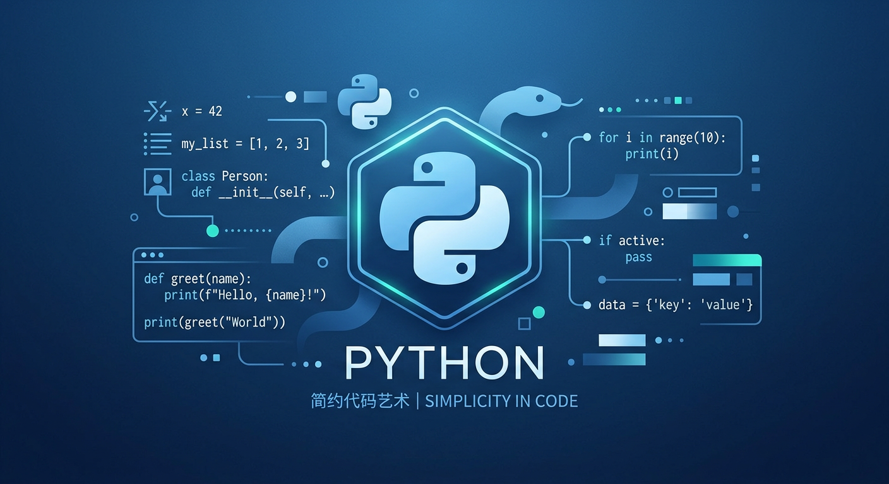

# 别再只让 AI 帮你写东西了，你更该让它替你盯变化

大多数人对 AI 的第一反应，还是“写点东西”。

写标题，写文案，写方案，写汇报，写脚本。  
这当然没错，因为生成内容是 AI 最显眼的能力，也是最容易被看见的能力。

但我这段时间越来越强烈地感觉到，很多人其实把 AI 用偏了。

**AI 最有价值的地方，不是替你输出，而是替你持续观察。**

说得更直白一点。

生成，只是让你少做一点。  
监控，才是让你少错过很多。

## 我越来越不相信“人能靠意志力盯住一切”

人不是不知道该做什么。

人真正的问题是：

- 知道，但忘了
- 看到了，但没跟进
- 想做，但拖延了
- 本来重要，但被杂事冲掉了
- 变化已经发生了，但自己还没反应过来

这才是日常生活和工作里最真实的损耗。

很多事情不是因为难，所以做不成。  
而是因为它们需要被持续盯住，但人天生就不适合做这种重复、分散、长期、细碎的观察工作。

你可以靠热情顶一两天。  
你也可以靠自律撑一阵子。  
但只要时间一拉长，项目一变多，信息一变杂，人就会开始漏。

所以我现在越来越觉得，AI 真正应该接手的，不是“替你思考全部”，而是“替你盯住变化”。

## 生成是表演，监控才是真正进入生活

为什么大家会高估生成，低估监控？

因为生成很像舞台中央的表演。

你给它一个题目，它几秒钟吐出一篇文章。  
你给它一句需求，它马上给你一版方案。  
这个反馈很强，很快，也很容易让人兴奋。

但监控不是这样的。

监控看起来没那么炫。  
它没有那种“哇，瞬间生成”的冲击感。  
它更像一个一直站在旁边、替你看门、盯表、守哨的人。

平时你甚至感觉不到它的存在。  
但一旦重要变化真的来了，它会第一时间把你拍醒。

这时候你才会意识到，**真正改变你生活效率的，往往不是一次性输出，而是持续性提醒。**

## 你真正需要 AI 盯住的，通常是这几类变化

### 1. 盯任务进度

很多项目不是死在不会做，而是死在没人追。

内容创作是这样。  
文章发布是这样。  
视频剪辑也是这样。  
一个选题今天没推进，明天又被别的事情打断，后天就彻底没了下文。

如果 AI 能持续盯住这些节点，它做的事情不复杂，但非常值钱：

- 今天开始了吗
- 这一步卡住了吗
- 这件事是不是该收尾了
- 现在该不该提醒你往前推进

它不是替你创作。  
它是在替你防止项目无声无息地烂尾。

### 2. 盯信息变化

很多重要信息不是“有没有”，而是“什么时候变了”。

比如：

- 一家公司什么时候发财报
- 一个热点什么时候突然爆了
- 一个关键词什么时候开始升温
- 一个产品什么时候放出新版本
- 一个你关注的方向，什么时候市场情绪变了

这些变化往往不是大到所有人都会第一时间知道。  
但它们又足够重要，足以影响你的判断和动作。

这类事情最适合 AI。

因为 AI 不会嫌烦，不会分神，不会因为今天心情不好就懒得看。  
它天生适合干这种“看起来不高级，但长期极其关键”的活。

### 3. 盯价格和信号

很多人以为盯盘是金融从业者的事。  
其实不是。

只要你在意某个价格、某个阈值、某个信号，你就已经有了“需要监控”的需求。

比如：

- 某个指数是不是从高点回撤到某个区间
- 某个基金最近一周是不是跌穿了你的预设线
- 黄金是不是进入极端区间
- 某只股票的关键事件出来后，是否触发你的动作规则

人自己去盯，最大的问题不是不会看。  
而是看得不连续，看得不一致，看得不客观。

你今天看一次，明天忘一次，后天情绪一上来又临时改标准。  
这就是为什么很多人最后不是输给市场，而是输给自己的随意。

如果 AI 按固定规则盯，它至少能帮你把“标准”先守住。

### 4. 盯日常生活里那些小但重要的事

我越来越觉得，AI 进入生活的标志，不是它能不能跟你聊哲学。  
而是它能不能替你把那些小但重要的变化看住。

比如：

- 明天要不要带伞
- 某个待办是不是拖太久了
- 某个提醒是不是又被你跳过去了
- 哪个计划现在已经偏离原轨道

这些东西都不宏大。  
甚至说出来有点琐碎。

但人的生活，本来就是由这些琐碎组成的。

真正让人轻松一点的，不是偶尔被 AI 惊艳一次。  
而是很多原本需要自己操心的小东西，被稳定接住了。

## 一个很现实的区别是，生成解决“启动”，监控解决“持续”

如果把 AI 的作用粗暴地分一下，我现在会这样看：

- **生成能力**，解决的是“从零开始”
- **监控能力**，解决的是“持续推进”

生成让你更容易开头。  
监控让你更不容易中断。

生成适合解决空白。  
监控适合解决衰减。

而现实里，大多数事情不是败在没有开始，  
而是败在开始以后，没有持续。

所以很多人觉得自己用了很多 AI，效率却没有真正跃迁。  
本质上可能是因为他们把 AI 主要用在了“开个头”，却没有把它布到“长期跟进”的链路上。

这就像你找了一个特别会写 PPT 的人，  
却没有找一个会持续帮你盯项目进度的人。

前者会让你觉得爽。  
后者才会真的改变结果。

## 未来最好用的 AI，不会像作家，更像哨兵

我现在越来越不把 AI 想成一个“超级写手”了。

我更愿意把它想成一个随时在线的观察层。

它平时不一定很吵。  
甚至最好别太吵。  
但它应该足够敏感，足够稳定，足够知道什么变化值得提醒你，什么变化只是噪音。

它不需要替你活。  
它也不需要替你做所有决定。  
它只需要在那些你容易漏掉的节点上，比你先看到一步。

这已经非常有用了。

很多人还在讨论，AI 会不会替代人。  
我反而觉得，一个更实际的问题是：

**你有没有把 AI 放在真正能帮你减少损耗的位置上。**

如果没有，那你其实还只是把它当成一个高级输入框。  
如果有，你会慢慢发现，它开始从工具变成系统的一部分。

## 最后一句

我现在的判断很简单。

**别再只让 AI 帮你写东西了。  
会写，只是基本功。  
会替你盯住变化，才是真正开始有用了。**

更狠一点说：

**生成只是表演，监控才是真正进入生活。**
